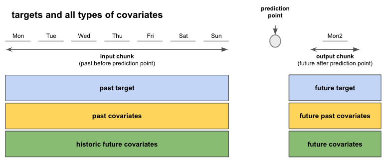
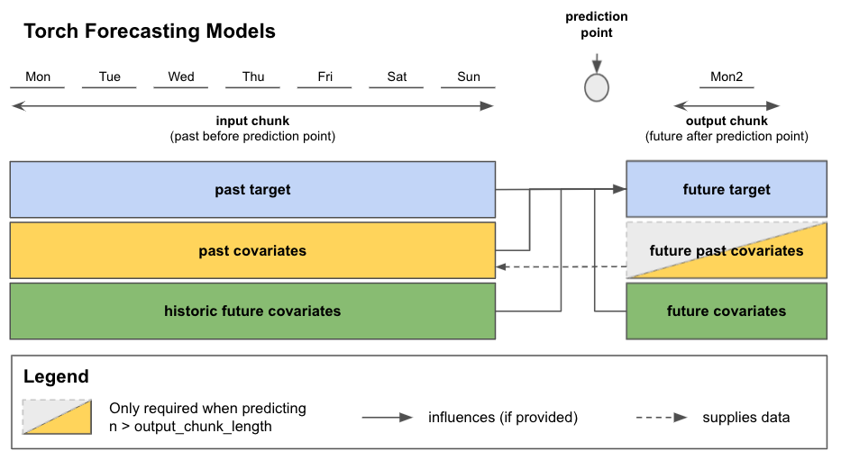
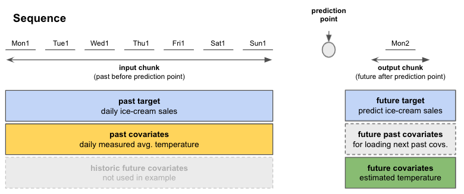
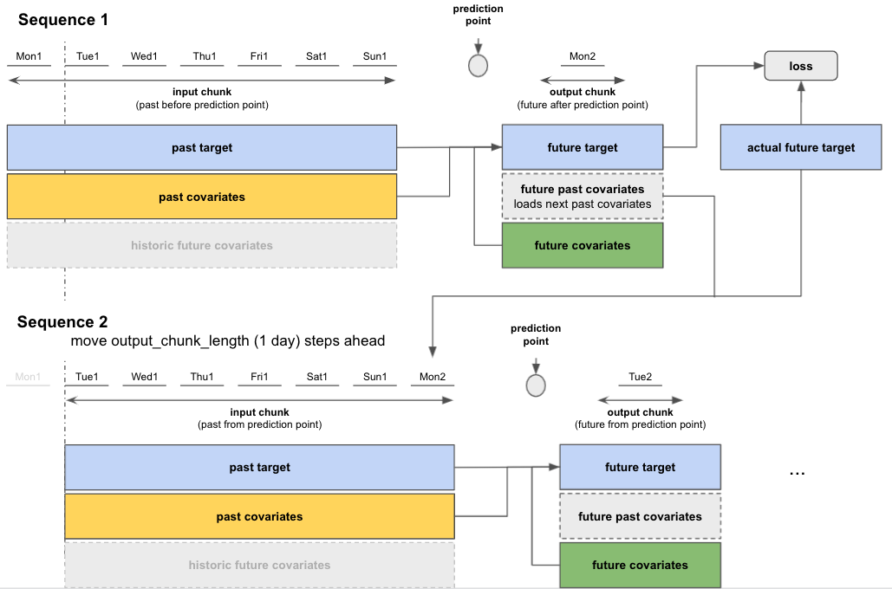
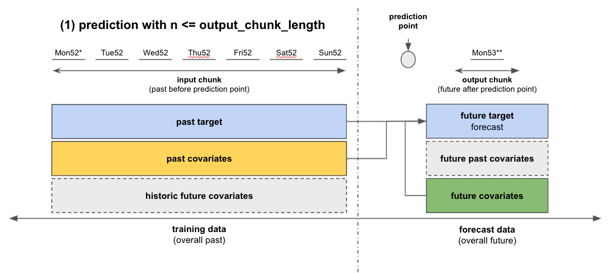
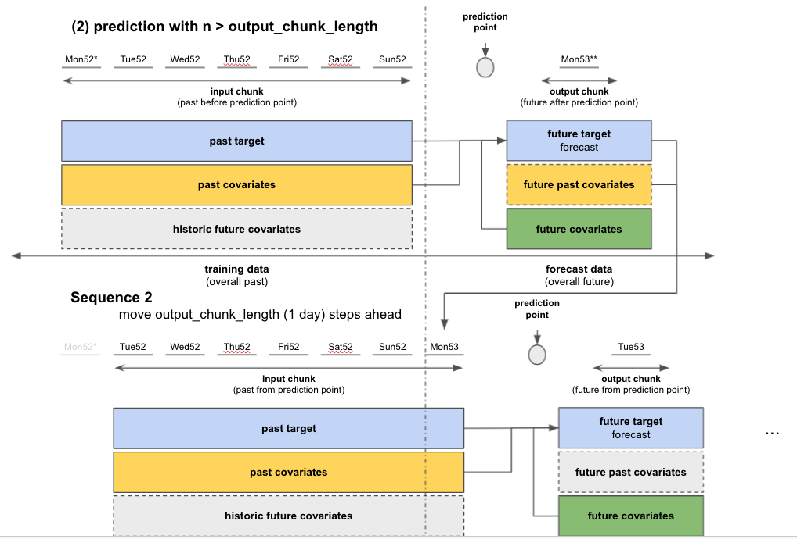

# Darts Covariates

## Overview
### Summary - TL;DR
In Darts, **covariates** refer to external data that can be used as inputs to models.
In the context of forecasting models, the **target** is the series to be forecasted/predicted, and the
covariates themselves are not predicted. We distinguish two kinds of covariates: 

* **past covariates** are (by definition) covariates known only into the past (e.g. measurements)
* **future covariates** are (by definition) covariates known into the future (e.g., weather forecasts)

Models in Darts accept `past_covariates` and/or `future_covariates` in their `fit()` and `predict()` methods, 
depending on their capabilities (some models accept no covariates at all). At the moment in Darts, all covariates
have to be `TimeSeries` themselves. We are also working on supporting **static covariates** but it's not the
case yet. Models supporting covariates expect one covariate series per target series (i.e., one `past_covariates`
series per target series and/or one `future_covariates` series per target series.). If you have several covariate
values that you want to use; e.g., as past covariates, you should `stack()` them together in a single `TimeSeries` 
first.

If you train a model using `past_covariates`, you'll have to also provide the `past_covariates` at
prediction time, and similarly for `future_covariates`. The nuance is that `future_covariates` have to extend far 
enough into the future at prediction time (all the way to the forecast horizon).


There are some extra nuances that might be good to know. For instance, deep learning models in Darts
can (in general) forecast `output_chunk_length` points at a time. However it is still possible for models 
trained with past covariates to make forecasts for some horizon `n > output_chunk_length` if the `past_covariates`
are known far enough into the future. In such cases, the forecasts are obtained by consuming future values
of the past covariates, and using auto-regression on the target series. If you want to know more details, read on.


### Content of this document

[Section 1](#1-introduction) and [section 2](#2-darts-xcovariatesmodels) cover the most important points:

- What are covariates in general and in Darts
- How to find out which type of covariate your variable is
- Intro to Darts' `{X}CovariatesModel` and which covariate types they support
- Covariate support for each of Darts' forecasting models
- How to use covariates in Darts' Standard and Torch Forecasting Models (deep learning moels)

[Section 3](#3-in-depth-look-at-how-past-and-future-covariates-are-used-in-a-sequential-torch-forecasting-model) gives
an in-depth guide of how covariates are used in Darts' Torch Forecasting Models and which requirements they have to
fulfil.

## 1. Introduction

## 1.1. What are covariates (in Darts)?

- Covariates provide additional information/context that can be useful to improve the prediction of the target series.
- Covariates can hold information about the past (upto and including present time) or future. 
  This is always relative to the prediction point (in time) after which we want to forecast the future.
    - Past covariates example: daily average **measured** traffic in neighboring stores for the last 7 days 
      before prediction time
    - Future covariates example: **estimated** temperature of the next day after prediction time
- Covariates can be time-varying or static (static not yet supported in Darts)
    - Time-varying example: daily average measured temperature over the course of a year for several named cities
    - Static example: location of each city, which does not change over time
- We do not predict the covariates themselves, only use them for prediction of other variables (target series).
    - Example: use past ice-cream sales (past target), daily average measured traffic in a neighboring store for
      the last 7 days (past covariate) and estimated temperature of the next day (future covariate) 
      to predict ice-cream sales of the next day (future target).

## 1.2. A few notes on using covariates with Darts' models

- If you want to use covariates, you can find out which type you have by
  reading [section 1.3](#13-how-to-determine-what-type-of-covariates-you-have)
- Models have different support modes for covariates. Some do not support covariates at all, others support either past or
  future covariates and some support both.
    - Find the (detailed) models' covariates support in [section 2](#2-darts-xcovariatesmodels), or a summary in
      the [README](https://unit8co.github.io/darts/README.html#forecasting-models).
- There are currently five different `{X}CovariatesModel` classes implemented in Darts that cover all combinations of past
  and future covariates. We will look at those later on in [section 2](#2-darts-xcovariatesmodels).
    - Each forecasting model inherits from exactly one `{X}CovariatesModel` type.
- Independent of which model you choose, past and future covariates are supplied as optional
  parameters `past_covariates` and `future_covariates` to `fit()` and `predict()`; more on that later on.
- Whenever past and/or future covariates are used during training with `fit()`, the same types of covariates must be
  supplied to the prediction/forecast with `predict()` as well.
    - Example: if you fit with `past_covariates` only, you must predict with `past_covariates` only

## 1.3. How to determine what type of covariates you have

Here's a simple rule-of-thumb to know if your series are past or future covariates:

*If the values are known in advance, it is a future covariates. If they are not, it is a past covariates.*

There are some subtleties, however. You might imagine cases where you want to train a model supporting only
`past_covariates` (such as `TCNModel`). In this case, you could use for instance, say, the temperature as a
past covariates for the model *even though you also have access to temperature forecasts in the future*. Knowing
such "future values of past covariates" can allow you to make forecasts further into the future (for horizons
`n > output_chunk_length`). Similarly most models consuming future covariates can also use "historic values of future
covariates". 

Figure 1 shows all variable types defined in Darts. The left side of the picture represents the past relative to the
prediction point, the right side the future.

The **target variable** is the variable we want to predict. Using past data of the target variable (**past target**), we
predict the next `n` target variable points (**future target**).

As explained above, **covariates** can help improve future target predictions by supplying additional information/context. There are two **
main types** of covariates with each having one **counter-part** (see Figure 1):

- **past covariates**: variables known in the past before the prediction point
    - "future past covariates": future data of past covariates after the prediction point required for predicting
      longer time horizons with certrain forecasting models.
- **future covariates**: variables known in the future after the prediction point
    - "historic future covariates": past/historic data of future covariates before the prediction point, which
      can be consumed by certain models.

[Section 2](#2-darts-xcovariatesmodels) will describe which covariate types are supported by each model.



**Figure 1: all variable types defined in Darts' forecasting models**

### 1.3.1 Example of how to identify covariates types
A good way to identify the **main** type of your covariates is to **think about what data is available in the
past/future when doing the actual prediction/forecast**.

Let's take the example from above, where we'll try to forecast sales for an ice-cream stand (target) for the
day ahead, using 7 days of sales history (past target), as well as both the affluence in a neighboring stand, 
as well as temperatures (covariates). 

We go through these thoughts in chronological order. First we ask ourselves if data is available for the future, and
second if data is available for the past:

- **measured** traffic in neighboring stands
    1. do we have **measured** traffic data for tomorrow (the future)? No -> this cannot be a future covariate
    2. do we have **measured** traffic data for the past 7 days? Yes -> so this must be a past covariate without a
       future counter-part
- **estimated** temperature variable
    1. do we have **estimated** temperature data for tomorrow? Yes (e.g. from weather forecasts) -> this can 
       definitely be used as a future covariate and could also be used as a past covariate if data is also 
       available for the past
    2. do we have **estimated** temperature data for the past 7 days? (Let's say) No -> this must be a future covariate
       without a historic counter-part
    2. same question as 2. but let's say Yes -> the past 7 days can either be used as a historic future covariate and we
       regard the variable as a future covariate **OR** we ignore the past 7 days and regard the variable as a future
       covariate without the historic counter-part **OR** we ignore the future part (tomorrow) and regard the variable
       as a past covariate.

(Side note: if you don't have future values (e.g. of measured traffic), nothing prevents you from applying
one of Darts forecasting models to forecast future traffic, and then use this as a future covariate. Darts is
not attempting to forecast the covariates for you, as this would introduce an extra "hidden" modeling step, which
we think is best left to the users.)


### Some key points can be drawn from this

- If we don't have future data of the variable, it must be a past covariate.
- If we only have future data of the variable, it must be a future covariate without the historic counter-part.
- If we have past and future data of the variable we can use the variable in three different ways:
    - As a future covariate with a historic counter-part by including both future and past.
    - As a future covariate without historic counter-part by ignoring the past.
    - As a past covariate with a future counter-part by including both past and future.

## Why it can be useful to have different options on how to use future covariates

We saw two important facts before:

- Future covariates with historic information can also be used as past covariates if desired,
- However past covariates without future information cannot be regarded as future covariates.

As mentioned in [section 1.2.](#12-a-few-notes-on-using-covariates-with-darts-models), Models offer different
support for covariates. For example: if a model only supports past covariates, future covariates could be regarded as
past covariates to be able to use the model. In the next section we look at the models in more detail.

## 2. Darts Covariates-aware Models

Under the hood, Darts has 5 types of `{X}CovariateModel` classes implemented to cover different 
combinations of covariate types.

Class | past covariates | future past covariates | future covariates | historic future covariates
--- | --- | --- | --- | ---
`PastCovariatesModel` | ✅ | ✅ |  |  |
`FutureCovariatesModel` |  |  | ✅ |  |
`DualCovariatesModel` |  |  | ✅ | ✅ |
`MixedCovariatesModel` | ✅ | ✅ | ✅ | ✅ |
`SplitCovariatesModel` | ✅ | ✅ | ✅ |  |

**Table 1: Darts' `{X}CovariatesModels` covariate support**

Each of Darts' forecasting model inherits from at most one `{X}CovariatesModel`. 
In Table 2 below you can find all models
with their corresponding `{X}CovariatesModel`. Covariate class names are abbreviated by the `X`-part.

Additionally, the 2nd and 3rd table columns indicate whether the model is a standard forecasting model or a neural
network based forecasting model (Torch).

Model | Standard <br /> Forecasting Model | Torch <br /> Forecasting Model | `Past` | `Future` | `Dual` | `Mixed` | `Split` |
--- | --- | --- | --- | --- | --- | --- | ---
`ExponentialSmoothing`* | 🟢 |  |  |  |  |  |  |
`Theta`* and `FourTheta`* | 🟢 |  |  |  |  |  |  |
`FFT`* | 🟢 |  |  |  |  |  |  |
`ARIMA` | 🟢 |  |  |  | ✅ |  |  |
`VARIMA` | 🟢 |  |  |  | ✅ |  |  |
`AutoARIMA` | 🟢 |  |  |  | ✅ |  |  |
`Prophet` | 🟢 |  |  |  | ✅ |  |  |
`RegressionModel`** |  |  |  |  |  | ✅ |  |
`RNNModel`*** |  | 🟢 |  |  | ✅ |  |  |
`BlockRNNModel`**** |  | 🟢 | ✅ |  |  |  |  |
`NBEATSModel` |  | 🟢 | ✅ |  |  |  |  |
`TCNModel` |  | 🟢 | ✅ |  |  |  |  |
`TransformerModel` |  | 🟢 | ✅ |  |  |  |  |
`TFT` |  | 🟢 |  |  |  | ✅ |  |

**Table 2: Darts' forecasting models and their `{X}CovariatesModel`**

`*` models that do not support covariates

`**` `RegressionModel` including `RandomForest`, `LinearRegressionModel` and `LightGBMModel`. `RegressionModel` is a
special kind of model which uses lags on covariates and past targets to do predictions.

`***` `RNNModel` including `LSTM` and `GRU`; equivalent to DeepAR in its probabilistic version

`****` `BlockRNNModel` including `LSTM` and `GRU`

## 2.1. Differences between Standard and Torch Forecasting Models regarding covariates

There are differences in how Darts' Standard and Torch Forecasting Models perform training and prediction. Specifically,
how they extract/work with the data supplied during `fit()` and `predict()`.

Below is a brief overview of how the models work.

### Standard forecasting models (SFMs):

- **training**
    - SFMs usually train on the entire data you supplied when calling `model.fit()` at once.
- **prediction**
    - SFMs can predict in one go for any number of predictions `n`


#### Figure 2: Standard Forecasting Model with past and future relative to the prediction point

### Torch forecasting models (TFMs):

- **training**
    - TFMs extract (sample) sub-sequences from the data you supplied when calling `model.fit()`. The models are trained
      on these sequences.
    - each sequence has its own prediction point that separates past (lookback window, **input chunk**) from future (
      forecast horizon, **output chunk**)
    - each sequence has the same number of time steps (length): the input chunk length and output chunk length are the
      same for all sequences
        - the input and output chunk lengths are specified at model creation by mandatory
          parameters `input_chunk_length` and `output_chunk_length`
- **prediction**
    - the prediction works similar to training on sequences. Depending on the length of your prediction `n`, the model
      can either do the prediction in one go, or through prediction on multiple chronologically shifted sequences
        - for `n <= output_chunk_length`: prediction on a single sequence
        - for `n > output_chunk_length`: prediction through multiple suquences

If you want to know more about how covariates are used in Darts' Torch Forecasting
Models, [section 3](#3-in-depth-look-at-how-past-and-future-covariates-are-used-in-a-sequential-torch-forecasting-model)
gives you an in-depth guide. This will further explain sequences, input and output chunks and the use of future past
covariates.



#### Figure 3: Torch Forecasting Model with input (past) and output chunks (future) relative to the prediction point of a single sequence

## 2.1.1. Required past and future covariates lengths for training and prediction with Standard and Torch Forecasting Models

Because of the differences in how SFMs and TFMs work with input data, the lengths (number of time steps) of our
covariates have must meet case specific requirements.

Table 3 summarizes the length requirements for past and future covariates when using `fit()` or `predict()` with SFMs or
TFMs. Depending on how many steps `n` into the future we want to predict, TFMs have different length requirements for
covariates.

With `model.fit()`, the length stands for the number of time steps before the prediction point (past).
With `model.predict()`, the length stands for the number of time steps after the prediction point (future).

Abbreviations:

- `n`: prediction length
- `ptl` : past target length
- `ocl` : sequence output chunk length (specified at torch model creation)
- `NS` : not supported
- `-` : does not have to be supplied

forecast with | `fit()` | past covariates | future covariates | `predict()` | past covariates | future covariates
--- | --- | --- | --- | --- | --- | ---
`Standard Forecasting Model` <br /> and for all `n` |  | NS | `ptl` |  | NS | `n` |
`Torch Forecasting Model` <br /> and `n <= ocl` | | `ptl` | `ptl` |  | - | `ocl` |
`Torch Forecasting Model` <br /> and `n > ocl` |  | `ptl` | `ptl` |  | `n - ocl` | `n` |

#### Table 3: Required past and future covariates lengths for training and prediction with different models and prediction lengths

## 3. In-depth look at how past and future covariates are used in a sequential Torch Forecasting Model

## 3.1. Training

For simplicity, we consider the same ice-cream sales forecasting example from before:

- past target: actual past ice-cream sales `past_ice_cream_sales`
- future target: predict the ice-cream sales for the next day
- past covariates: measured average daily temperatures in the past `measured_past_temperature`
- future covariates: estimated average temperature for the next day `estimated_future_temperature`

Checking Table 1, this is a `SplitCovariatesModel`. (Just as an example: if we wanted to use historic **estimated**
temperatures as well, we would need a `MixedCovariatesModel`.)

Let's assume we have one year (365 days) of daily ice-cream sales and measured/estimated daily average temperature data
available for training.

We can create a model and train it with:

```
model = SomeDartsSequentialTorchModel(input_chunk_length=7, output_chunk_length=1)
model.fit(series=past_ice_cream_sales,
          past_covariates=measured_past_temperature, 
          future_covariates=estimated_future_temperature)
```

During training, the sequential torch models will go through your training data in sequences with **input chucks** of
length `input_chunk_length` and **output chunks** of length `output_chunk_length` (see Figure 4 below).

For this example we used:

- `input_chunk_length = 7` days (use daily data from the past week)
- `output_chunk_length = 1` day (predict the next day)

The **prediction point** for each sequence separates input chunk from output chunk.

- the input chunk represents the past relative to the sequence's prediction point. In our case, the input chunk of each
  sequence contains values of the last 7 days from past targets and past covariates.
- the output chunk represents the future relative to the sequence's prediction point. In our example, the output chunk
  of each sequence contains the value of the next day from future covariates.

Mon1 - Sun1 stand for the first 7 days from our training dataset (week 1 of the year). Mon2 is the Monday of week 2.

Note that historic future covariates and future past covariates are greyed out in Figure 4. Historic future covariates
are not supported by `SplitCovariatesModel`. The future past covariates in the training process are automatically
extracted from the past covariates (`measured_past_temperature`) you supplied to `model.fit()`. They are internally used
to load the next past covariates for coming sequences.



#### Figure 4: Overview of a single sequence from our ice-cream sales example

Using information from the **input chunk** (past target and past covariates) and **output chunk**
(future covariates), the model predicts the future target on the output chunk (see Figure 5 below).

The loss is evaluated between the predicted future target and the actual target value on the output chunk. The model
trains itself (the weights) by minimizing the loss over all sequences.


#### Figure 5: Prediction and loss evaluation in a single sequence

After having completed computations on the first sequence, the model moves to the next sequence which
starts `output_chunk_length` (here 1 day) steps after the first sequence (see Figure 6 below).

New data points are loaded for the past target, past covariates and future covariates from the remaining unused data (
the 365 days train dataset).

The model predicts the new future target and evaluates the loss.

This is repeated for all coming sequences until the 365 days are covered.



#### Figure 6: Move to next sequence and repeat

### 3.1.1. Requirements for training with past and future covariates

Training only works if at least one sequence with an input and output chunk can be extracted from the data you passed
to `fit()`.

- past target of minimum length `input_chunk_length + output_chunk_length`
    - 8 days: first 7 days for the input chunk 8th day for the output chunk
- past covariates of minimum length `max(input_chunk_length, past_target_length - output_chunk_length)`
    - 7 days: first 7 days for the input chunk
- future covariates (in our example) of minimum
  length: `max(output_chunk_length, past_target_length - input_chunk_length)`
    - 1 day: 8th day for the output chunk

A good thing in Darts is that you can supply covariates of any length larger than the minimum requirement. Meaning that
the relevant covariate time sections will be extracted automatically by the forecasting models.

### 3.1.2. Training with a validation dataset

You can train your models with a validation dataset with:

```
# create train and validation sets
past_ice_cream_sales_train, past_ice_cream_sales_val = past_ice_cream_sales.split_after(training_cutoff)

# train with validation set
model.fit(series=past_ice_cream_sales_train,
          past_covariates=measured_past_temperature, 
          future_covariates=estimated_future_temperature,
          val_series=past_ice_cream_sales_val,
          val_past_covariates=measured_past_temperature,
          val_future_covariates=estimated_future_temperature)
```

You have to define a `training_cutoff` (a date or fraction at which to split the dataset) so that both the train and
validation datasets satisfy the minimum length requirements
from [section 3.1.1.](#311-requirements-for-training-with-past-and-future-covariates)

The model trains itself the same way as before but additonally evaluates the loss on the validation dataset and keeps
track of the best performing model.

## 3.2. Forecast/Prediction

After having trained the model, we want to predict the future ice-cream sales for any number of days after our 365 days
training data.

The actual prediction works very similar to how we trained the data on sequences. Depending on the number of days we
want to predict, `n`, we distinguish between two cases:

- (1) if `n <= output_chunk_length`: we can predict `n` with a single sequence
    - example: we only want to predict the next day's ice-cream sales (`n = 1`)
- (2) if `n > output_chunk_length`: we must predict `n` by going through multiple sequences. Each sequence
  outputs `output_chunk_length` prediction points. We go through as many sequences, until we get to the final `n`
  prediction points.
    - example: we want to predict ice-cream sales for the next 3 days at once (`n = 3`)

A few notes on which data must be supplied to do predictions:

- we do not have to supply past targets, as they were saved during training
- whenever we used past covariates during training, we must **only** supply additional past covariates for prediction
  case (2) (from above)
- whenever we used future covariates during training, we must **always** supply future covariates for predictions

### (1) Forecast with `n <= output_chunk_length`:

We set our forecast horizon `n` to `1` which is equal to the `output_chunk_length` used before.

Using information from the input chunk (past target and past covariates) and output chunk (future covariates), the model
predicts the future target on the output chunk (see Figure 7 below).

Mon52 - Sun52 stand for the last `input_chunk_length` days (7 days) of our one-year training dataset (week 52).

As we used an `output_chunk_length` of `1`, `Mon53` is the first day/monday of the next year that we want to predict
ice-cream sales for (week 53, or the first week in the next year).

Do we have to supply additional data to `predict()`?

- As you can see, for this prediction case (1), past targets and past covariates come from our training data and we **do
  not have to supply** them again.
- For the future covariates, we **must supply additional data** for `output_chunk_length` days from our actual forecast
  horizon! In this example, the estimated average temperature for `Mon53`

So we can predict with:

```
ice_cream_sales_tomorrow = model.predict(n=1, future_covariates=estimated_temperature_mon53)
```



#### Figure 7: forecast with a single sequence for n <= `output_chunk_length`

### (2) Forecast with `n > output_chunk_length`:

We set our forecast horizon `n` to `3` which is larger than the `output_chunk_length`.

In this case (2), the prediction for the next 3 days is obtained by predicting on several sequences similar to training
on multiple sequences from before (see Figure 8 below).

For every sequence, we predict `output_chunk_length` number of points, then go to the next sequence which is shifted
by `output_chunk_length` points into the future and perform prediction again. This process is repeated until we get the
desired `n` predictions.

In our example, prediction is performed on 3 sequences (each of `output_chunk_length = 1`) to obtain the forecast for
the next `n = 3` days.

In Figure 8, you can see that from Sequence 2 on, our input chunk contains data from the forecast horizon (the last
input chunk elements after the dashed vertical line).

Do we have to supply additional data to `predict()`?

- past targets: **do not have to be supplied** as our predictions from previous sequences are automatically appended to
  the past target.
- future covariates: we **must supply** the next `n` future covariate data points from out forecast horizon (Mon53 -
  Wed53)
    - in our example: the **estimated** average temperature for the next 3 days (Mon53 - Wed53)
- past covariates: we **must supply** the next `n - output_chunk_length` past covariate data points from our forecast
  horizon to obtain `n` predictions.
    - in our example: we would need to supply the **measured** average daily temperature for the next `3 - 1 = 2` days (
      Mon53, Tue53)
    - these additional past covariates are internally called **future** past cast covariates (see the yellow box with
      dashed borders)

We can predict ice-cream sales for the next 3 days with:

```
ice_cream_sales_next_days = model.predict(n=1,
                                          past_covariates=measured_tempereature_next_two_days,
                                          future_covariates=estimated_temperature_next_three_days)
```

But it is impossible to have **measured** data from the future! True, and that is the reason why this particular
forecast case (2) cannot work with the given `n`, `output_chunk_length` and past covariates.

Fortunately, there is a way how you could still get forecasts for `n = 3`:

- set `output_chunk_length` at model creation to be larger than or equal to `n`, so that we do not have to supply **
  measured future** past covariates.
- keep in mind that all minimum length requirements
  from [section 3.1.1.](#311-requirements-for-training-with-past-and-future-covariates)
  and [section 3.2.1.](#321-requirements-for-prediction-with-past-and-future-covariates) are satifisfied for the
  new `output_chunk_length`



#### Figure 8: forecast with multiple sequences and `n > output_chunk_length`

### When can we predict with `n > output_chunk_length`?

It is possible to predict with forecast horizons `n` longer than your `output_chunk_length` when all of the following
conditions are met:

- if future covariates are used: must be supplied for `n` points in the future
- if past covariates are used:
    - past covariates must be known in the future (e.g. day of the week, hour of the day, week of the year, year, ...)
    - must be supplied for `n - output_chunk_length` points in the future

### 3.2.1. Requirements for prediction with past and future covariates

To summarize the requirements for the two cases:

#### Case (1) with `n <= output_chunk_length`

Prediction only works if at least one sequence with an input and output chunk can be extracted from the data you passed
to `predict()`:

- nothing required for past targets and past covariates on input chunk; the data comes from training process
- supply future covariates of minimum length `output_chunk_length` from future

#### Case (2) with `n > output_chunk_length`

Prediction only works by supplying the following data to `predict()`:

- nothing required for past targets
- past covariates of minimum length `n - output_chunk_length` from future
    - requires past covariates to be known in future
- future covariates of minimum length `n` from future horizon